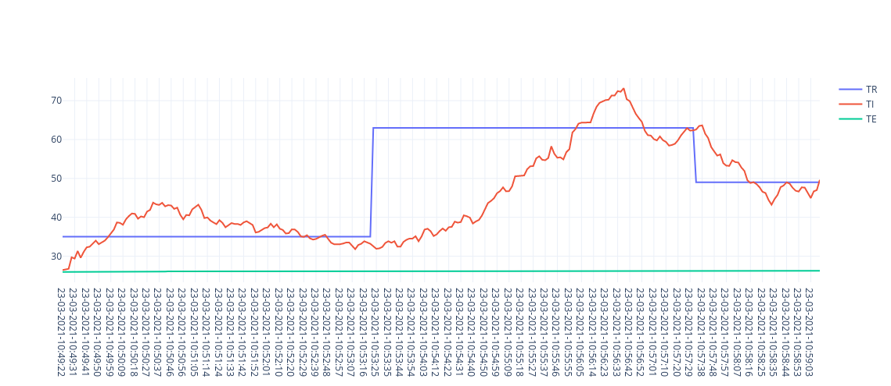
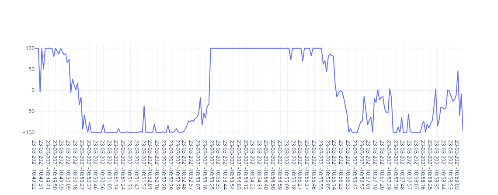
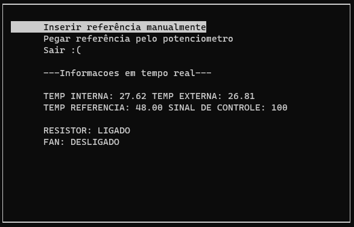

# FSE - Controle de temperatura

Projeto de controle de temperatura PID. O objetivo é controlar a temperatura em um sistema fechado constituido por um resistor e um fan para resfriar e aquecer a temperatura. 
Bem como um potenciômetro, que pode ser utilizado para definir a temperatura desejada, e sensores de temperatura interna e ambiente, que são acessados através da UART e do protocolo i2c respectivamente.
O usuário também pode optar por inserir a temperatura desejada através do terminal.

Conforme a temperatura é ajustada as informações são atualizadas no terminal e no display LCD. Além disso, a cada dois segundos todas elas são registadas em um log no formato CSV, que se localiza na raiz do projeto.

#### Aluno: Marcos Nery Borges Júnior - 170017885

## Execução
* **Linguagem:** C
* **Instruções de execução:** 
1. Clonar o repositório executando ```git clone https://github.com/MarcosNBJ/fse_temperature_control.git``` 
2. Ir para o diretório clonado executando ``` cd fse_temperature_control```
3. Compilar o projeto executando ```make```
4. Finalmente, é possível executar tudo com o comando ```make run```

* **Instruções de uso:** 
Assim que executado, as informações começarão a ser atualizadas na tela. Caso o usuário deseje escolher uma temperatura manualmente, voltar ao potenciômetro ou sair, basta utilizar o menu.

## Gráficos

### Gráfico das temperaturas
Esse é um gráfico que mostra a variação das temperaturas internas, externas e de referência, durante aproximadamente dez minutos de execução do projeto no ambiente controlado.


### Gráfico do valor de acionamento dos atuadores
Esse é um gráfico que mostra a variação dos valores de acionamento dos atuadores ao longo dos dez minutos de execução. Os valores são em porcentagem (%). Um valor positivo significa acionamento do resistor, um negativo implica possível acionamento da ventoinha.


## Screenshots do projeto


